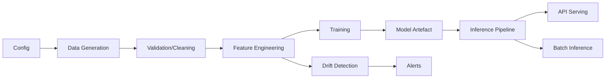

# MLOps Course: System Architecture

## Overview
This document describes the architecture of the end-to-end MLOps pipeline implemented in the course. It covers data flow, component interactions, and deployment patterns.

## Architecture Diagram

## Components
- Data Ingestion & Preparation
- Feature Engineering
- Model Training & Experiment Tracking
- Model Registry & Promotion
- Model Serving (API)
- Monitoring & Drift Detection
- CI/CD Automation
- Business Metrics & Reporting

## Data Flow
1. Raw data is ingested and validated.
2. Features are engineered and selected.
3. Models are trained, tracked, and registered.
4. The best model is promoted and deployed as an API.
5. Monitoring tracks performance, drift, and business impact.
6. CI/CD automates testing and deployment.

## Deployment Patterns
- Docker-based containerization
- FastAPI for model serving
- GitHub Actions for CI/CD

## Extensibility
- Modular codebase for easy extension
- Configurable pipeline stages
- Pluggable monitoring and alerting

---
This architecture supports scalable, production-grade ML workflows for real-world applications.
