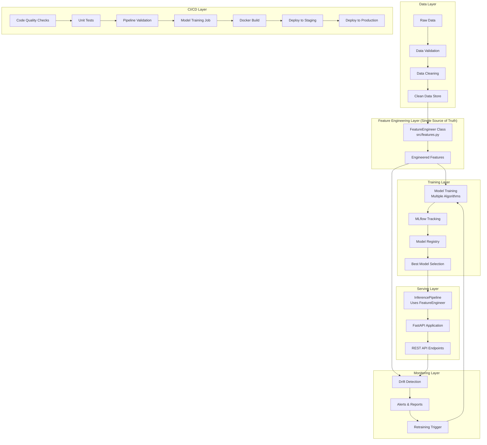
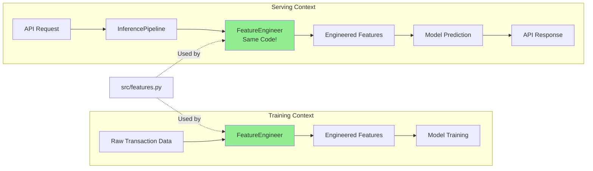
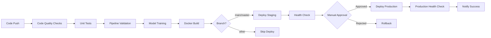

# MLOps Course: System Architecture

## Overview
This document describes the architecture of the end-to-end MLOps pipeline implemented in the course. It covers data flow, component interactions, and deployment patterns.

## High-Level Architecture Diagram



## Feature Engineering Flow (Training/Serving Parity)



## Components

### Data Layer
- **Data Generation**: Synthetic transaction data with configurable fraud patterns
- **Data Validation**: Schema validation, outlier detection, quality checks
- **Data Cleaning**: Handling missing values, capping outliers, type conversion

### Feature Engineering Layer (Single Source of Truth)
- **Location**: `src/features.py`
- **Core Class**: `FeatureEngineer`
- **Capabilities**:
  - Temporal features (hour_of_day, day_of_week, is_weekend, business_hours)
  - Amount features (log transform, round amount detection, categories)
  - User behavior features (transaction counts, averages, z-scores)
  - Frequency features (time since last transaction, velocity)
  - Location features (usual location detection)
  - Device features (usual device detection)
  - Merchant features (category encoding)
- **Critical Design**: Same code used in training, inference, and serving to prevent training/serving skew

### Model Training & Experiment Tracking
- **Training Pipeline**: `src/pipelines/run_training_pipeline()`
- **Algorithms Supported**:
  - Logistic Regression
  - Random Forest
  - XGBoost (optional)
- **Experiment Tracking**: MLflow for parameters, metrics, and artifacts
- **Model Selection**: Automatic best model selection based on ROC-AUC
- **Artifacts Saved**: Models (joblib), feature metadata, training reports

### Model Registry & Deployment
- **Registry**: MLflow Model Registry
- **Versioning**: Automatic versioning of all trained models
- **Promotion**: Best models promoted to "Staging" or "Production" stages
- **Loading**: Inference pipeline can load from MLflow or local filesystem

### Model Serving (API)
- **Framework**: FastAPI
- **Endpoints**:
  - `POST /predict` - Single transaction fraud prediction
  - `GET /health` - Service health check
  - `GET /sample-transaction` - Get sample transaction for testing
  - `GET /metrics` - API performance metrics
  - `POST /save-logs` - Persist prediction logs
- **Architecture**: FastAPI → InferencePipeline → FeatureEngineer → Model
- **Features**: Automatic feature engineering, probability scores, risk levels

### Monitoring & Drift Detection
- **Drift Detection**: Statistical tests (Kolmogorov-Smirnov, Chi-square) for distribution changes
- **Monitoring Dimensions**:
  - Data drift (feature distribution changes)
  - Concept drift (fraud pattern changes)
  - Model performance degradation
- **Alerting**: Severity-based alerts (no drift, moderate, severe, critical)
- **Automation**: Scheduled drift detection via CI/CD (daily)
- **Retraining Triggers**: Automated retraining when critical drift detected

### CI/CD Automation
- **Platform**: GitHub Actions
- **Workflows**:
  1. **Code Quality**: black, isort, flake8 on every push/PR
  2. **Unit Tests**: pytest with coverage reporting
  3. **Pipeline Validation**: Full data pipeline execution
  4. **Model Training**: Automated training on main branch
  5. **Docker Build**: Container image building and testing
  6. **Deployment**: Staging (auto) → Production (manual approval)
  7. **Drift Monitoring**: Scheduled daily drift detection
- **Artifacts**: Models, datasets, reports uploaded and versioned

### Configuration Management
- **Format**: YAML configuration files
- **Files**:
  - `configs/training_config.yaml` - Training parameters, model settings
  - `configs/serving_config.yaml` - API settings, model loading
- **Access**: Centralized via `ConfigManager` class
- **Validation**: Type checking and default values

## Data Flow

### Training Flow
1. **Data Generation**: Synthetic transaction data created with configurable fraud rate
2. **Data Validation**: Quality checks, schema validation, outlier detection
3. **Data Cleaning**: Missing value handling, outlier capping, type conversion
4. **Feature Engineering**: `FeatureEngineer.create_all_features()` creates all features
5. **Feature Selection**: Statistical and model-based feature selection
6. **Data Splitting**: Stratified train/validation/test split
7. **Model Training**: Multiple algorithms trained with cross-validation
8. **MLflow Tracking**: Parameters, metrics, and artifacts logged
9. **Model Registration**: Best model registered in MLflow Model Registry
10. **Artifacts Saved**: Model file, feature metadata, training reports

### Inference Flow (API)
1. **API Request**: Client sends transaction data via POST /predict
2. **Request Validation**: Pydantic schema validates required fields
3. **DataFrame Creation**: Transaction converted to pandas DataFrame
4. **Feature Engineering**: `FeatureEngineer.create_all_features()` (same code as training!)
5. **Feature Alignment**: Features aligned with training feature set
6. **Model Prediction**: Loaded model generates fraud probability
7. **Post-processing**: Risk level assignment, response formatting
8. **Logging**: Prediction logged for monitoring
9. **API Response**: JSON response with fraud probability and risk level

### Batch Inference Flow
1. **Data Loading**: Batch of transactions loaded from CSV/database
2. **Feature Engineering**: `FeatureEngineer.create_all_features()`
3. **Batch Prediction**: Model predicts on entire batch
4. **Results Export**: Predictions saved to CSV with fraud cases flagged
5. **High-Risk Flagging**: Transactions above threshold flagged for review

### Drift Detection Flow
1. **Reference Data**: Historical "good" data loaded (training set)
2. **Current Data**: Recent production data loaded
3. **Feature Extraction**: Features engineered using `FeatureEngineer`
4. **Statistical Tests**: KS test (numerical), Chi-square test (categorical)
5. **Drift Calculation**: P-values computed for each feature
6. **Severity Assessment**: Drift categorized (none, moderate, severe, critical)
7. **Alert Generation**: Alerts created for drifted features
8. **Retraining Trigger**: If critical drift, automated retraining initiated

## Deployment Patterns

### Local Development
```bash
# Run notebooks for exploration
jupyter notebook notebooks/

# Run full pipeline
python scripts/run_full_pipeline.py

# Start API locally
uvicorn src.serving.main:app --reload --port 8000
```

### Docker Deployment
```bash
# Build container
docker build -t fraud-detection-api .

# Run container
docker run -p 8000:8000 -v $(pwd)/models:/app/models fraud-detection-api

# Docker Compose (with MLflow)
docker-compose up
```

### Cloud Deployment Patterns

#### Container-based (Kubernetes)
```yaml
# Deployment strategy
- Build: GitHub Actions builds and pushes to container registry
- Deploy: Kubernetes pulls image and creates pods
- Service: LoadBalancer exposes API externally
- Scaling: Horizontal Pod Autoscaler based on CPU/requests
- Monitoring: Prometheus scrapes /metrics endpoint
```

#### Serverless (AWS Lambda / Cloud Run)
```yaml
# Deployment strategy
- Packaging: Containerize with minimal dependencies
- Deployment: Push to AWS ECR / GCP Artifact Registry
- Serving: Lambda / Cloud Run handles auto-scaling
- Cost: Pay only for inference requests
- Limitations: Cold start latency, timeout constraints
```

#### Platform-as-a-Service (AWS SageMaker / Azure ML)
```yaml
# Deployment strategy
- Model: Upload to platform's model registry
- Endpoint: Create managed endpoint with auto-scaling
- Monitoring: Built-in monitoring and drift detection
- Cost: Higher than containers, but fully managed
```

### CI/CD Deployment Flow



### Blue-Green Deployment
```yaml
# Strategy for zero-downtime deployments
1. Deploy new version (green) alongside existing (blue)
2. Run smoke tests on green environment
3. Gradually shift traffic from blue to green (canary)
4. Monitor error rates and latency
5. If successful, complete cutover
6. Keep blue as rollback option for 24-48 hours
```

## Extensibility

### Adding New Features
1. **Implement** in `src/features.py` within `FeatureEngineer` class
2. **Test** in `tests/test_feature_parity.py`
3. **Document** feature purpose and computation
4. **Retrain** models with new features
5. **Deploy** - feature automatically available in serving via `InferencePipeline`

### Adding New Models
1. **Configure** in `configs/training_config.yaml`
2. **Implement** training logic in `src/pipelines/training_pipeline.py`
3. **Test** model performance in notebooks
4. **Track** experiments in MLflow
5. **Register** best model for production use

### Adding New Monitoring Metrics
1. **Implement** metric calculation in `src/drift_detection.py`
2. **Add** to drift detection reports
3. **Configure** alert thresholds
4. **Integrate** with CI/CD scheduled jobs
5. **Visualize** in monitoring dashboards

### Integrating External Data Sources
1. **Create** data connector in `src/data_generation/`
2. **Implement** validation logic
3. **Map** to standard schema
4. **Test** with feature engineering pipeline
5. **Update** configuration files

### Custom Deployment Targets
1. **Platform-specific** containerization (if needed)
2. **Update** CI/CD workflows in `.github/workflows/`
3. **Add** deployment scripts to `scripts/`
4. **Configure** environment-specific settings
5. **Document** deployment procedures in `docs/deployment_guide.md`

### Pluggable Alerting Systems

```python
# Example: Custom alerting integration
from src.drift_detection import DriftDetector

class CustomAlerter:
    def send_alert(self, drift_report):
        # Integrate with Slack, PagerDuty, etc.
        severity = drift_report.get('overall_severity')
        if severity in ['SEVERE', 'CRITICAL']:
            self.notify_team(drift_report)
```

---

## Key Design Principles

### 1. Single Source of Truth
- **Feature Engineering**: All features computed by `src/features.py`
- **Configuration**: Centralized in YAML files, accessed via `ConfigManager`
- **Model Logic**: Training and inference use same pipeline code

### 2. Training/Serving Parity
- Same code path for feature engineering in training and production
- Validated by automated tests in `tests/test_feature_parity.py`
- Prevents model degradation due to feature computation differences

### 3. Modular Architecture
- Clear separation of concerns (data, features, training, inference, serving)
- Each module independently testable
- Easy to extend without breaking existing functionality

### 4. Configuration-Driven
- Behavior controlled by YAML config files
- No hardcoded parameters in code
- Easy to experiment with different settings

### 5. Automated Quality Gates
- CI/CD enforces code quality, tests, and pipeline validation
- No manual deployment reduces human error
- Automated monitoring detects issues early

### 6. Observable and Monitorable
- Comprehensive logging at all stages
- MLflow tracking for experiment history
- Drift detection for data quality
- API metrics for production monitoring

---

## Technology Stack

### Core ML Stack
- **Python 3.11**: Primary programming language
- **pandas, numpy**: Data manipulation and numerical computing
- **scikit-learn**: Machine learning algorithms and utilities
- **XGBoost**: Advanced gradient boosting (optional)

### MLOps Tools
- **MLflow**: Experiment tracking, model registry, deployment
- **pytest**: Unit and integration testing
- **black, flake8, isort**: Code quality and formatting

### API & Serving
- **FastAPI**: Modern, high-performance web framework
- **uvicorn**: ASGI server for FastAPI
- **Pydantic**: Data validation and serialization

### Infrastructure
- **Docker**: Containerization for consistent environments
- **Docker Compose**: Multi-container orchestration
- **GitHub Actions**: CI/CD automation

### Monitoring
- **Custom drift detection**: Statistical tests for distribution changes
- **Logging**: Python logging module with structured logs
- **Future**: Prometheus, Grafana (mentioned in improvement plan)

---

This architecture supports scalable, production-grade ML workflows for real-world applications while maintaining educational clarity for learning MLOps best practices.
