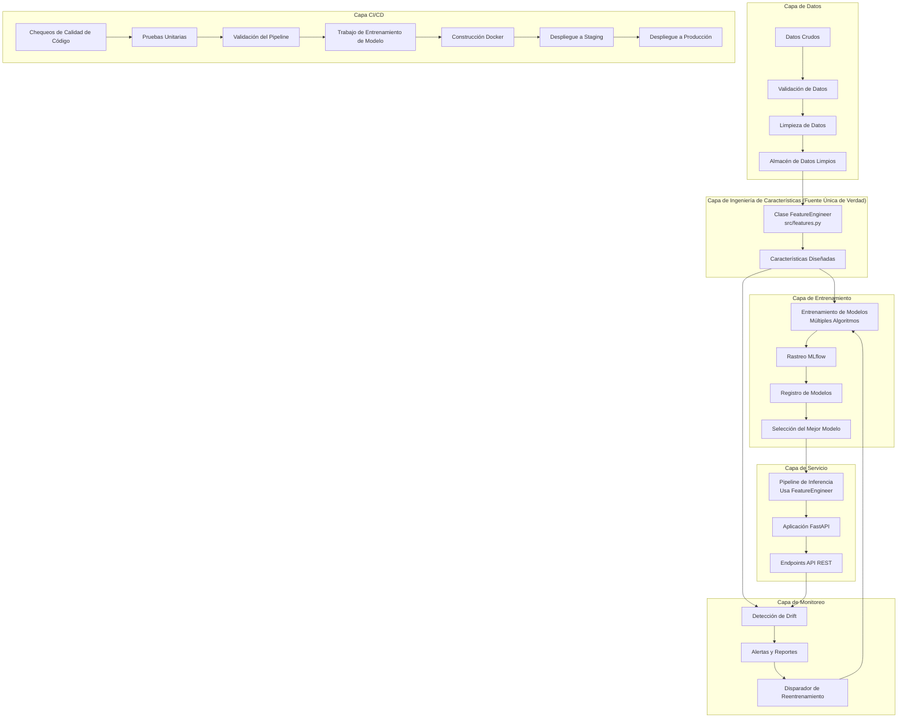
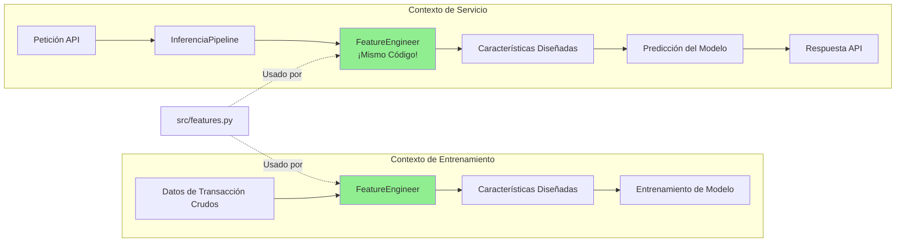
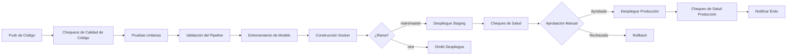

# Curso MLOps: Arquitectura del Sistema

## Descripción General
Este documento describe la arquitectura del pipeline MLOps de extremo a extremo implementado en el curso. Cubre el flujo de datos, las interacciones entre componentes y los patrones de despliegue.

## Diagrama de Arquitectura de Alto Nivel



## Flujo de Ingeniería de Características (Paridad Entrenamiento/Servicio)



## Componentes

### Capa de Datos
- **Generación de Datos**: Datos de transacciones sintéticas con patrones de fraude configurables.
- **Validación de Datos**: Validación de esquema, detección de valores atípicos, chequeos de calidad.
- **Limpieza de Datos**: Manejo de valores faltantes, limitación de valores atípicos, conversión de tipos.

### Capa de Ingeniería de Características (Fuente Única de Verdad)
- **Ubicación**: `src/features.py`
- **Clase Principal**: `FeatureEngineer`
- **Capacidades**:
  - Características temporales (hora del día, día de la semana, es fin de semana, horario comercial)
  - Características de monto (transformación logarítmica, detección de montos redondos, categorías)
  - Características de comportamiento del usuario (conteos de transacciones, promedios, puntuaciones z)
  - Características de frecuencia (tiempo desde la última transacción, velocidad)
  - Características de ubicación (detección de ubicación habitual)
  - Características de dispositivo (detección de dispositivo habitual)
  - Características de comercio (codificación de categoría)
- **Diseño Crítico**: El mismo código se usa en entrenamiento, inferencia y servicio para prevenir sesgos entre entrenamiento y servicio.

### Entrenamiento de Modelos y Rastreo de Experimentos
- **Pipeline de Entrenamiento**: `src/pipelines/run_training_pipeline()`
- **Algoritmos Soportados**:
  - Regresión Logística
  - Random Forest
  - XGBoost (opcional)
- **Rastreo de Experimentos**: MLflow para parámetros, métricas y artefactos.
- **Selección de Modelos**: Selección automática del mejor modelo basada en ROC-AUC.
- **Artefactos Guardados**: Modelos (joblib), metadatos de características, reportes de entrenamiento.

### Registro de Modelos y Despliegue
- **Registro**: Registro de Modelos de MLflow.
- **Versionado**: Versionado automático de todos los modelos entrenados.
- **Promoción**: Los mejores modelos se promueven a las etapas "Staging" o "Production".
- **Carga**: El pipeline de inferencia puede cargar desde MLflow o el sistema de archivos local.

### Servicio de Modelos (API)
- **Framework**: FastAPI
- **Endpoints**:
  - `POST /predict` - Predicción de fraude para una sola transacción
  - `GET /health` - Chequeo de salud del servicio
  - `GET /sample-transaction` - Obtener transacción de muestra para pruebas
  - `GET /metrics` - Métricas de rendimiento de la API
  - `POST /save-logs` - Persistir logs de predicción
- **Arquitectura**: FastAPI → InferencePipeline → FeatureEngineer → Modelo
- **Características**: Ingeniería de características automática, puntuaciones de probabilidad, niveles de riesgo.

### Monitoreo y Detección de Drift
- **Detección de Drift**: Pruebas estadísticas (Kolmogorov-Smirnov, Chi-cuadrado) para cambios en la distribución.
- **Dimensiones de Monitoreo**:
  - Drift de datos (cambios en la distribución de características)
  - Drift de concepto (cambios en los patrones de fraude)
  - Degradación del rendimiento del modelo
- **Alertas**: Alertas basadas en severidad (sin drift, moderado, severo, crítico).
- **Automatización**: Detección de drift programada vía CI/CD (diaria).
- **Disparadores de Reentrenamiento**: Reentrenamiento automatizado cuando se detecta drift crítico.

### Automatización CI/CD
- **Plataforma**: GitHub Actions
- **Flujos de Trabajo**:
  1. **Calidad de Código**: black, isort, flake8 en cada push/PR
  2. **Pruebas Unitarias**: pytest con reporte de cobertura
  3. **Validación del Pipeline**: Ejecución completa del pipeline de datos
  4. **Entrenamiento de Modelo**: Entrenamiento automatizado en la rama main
  5. **Construcción Docker**: Construcción y prueba de imagen de contenedor
  6. **Despliegue**: Staging (auto) → Producción (aprobación manual)
  7. **Monitoreo de Drift**: Detección de drift diaria programada
- **Artefactos**: Modelos, datasets y reportes subidos y versionados.

### Gestión de Configuración
- **Formato**: Archivos de configuración YAML
- **Archivos**:
  - `configs/training_config.yaml` - Parámetros de entrenamiento, configuraciones del modelo
  - `configs/serving_config.yaml` - Configuraciones de API, carga de modelos
- **Acceso**: Centralizado vía la clase `ConfigManager`
- **Validación**: Chequeo de tipos y valores por defecto

## Flujo de Datos

### Flujo de Entrenamiento
1. **Generación de Datos**: Datos de transacciones sintéticas creados con tasa de fraude configurable.
2. **Validación de Datos**: Chequeos de calidad, validación de esquema, detección de valores atípicos.
3. **Limpieza de Datos**: Manejo de valores faltantes, limitación de valores atípicos, conversión de tipos.
4. **Ingeniería de Características**: `FeatureEngineer.create_all_features()` crea todas las características.
5. **Selección de Características**: Selección de características estadística y basada en modelos.
6. **División de Datos**: División estratificada en entrenamiento/validación/prueba.
7. **Entrenamiento de Modelo**: Múltiples algoritmos entrenados con validación cruzada.
8. **Rastreo MLflow**: Parámetros, métricas y artefactos registrados.
9. **Registro de Modelo**: El mejor modelo se registra en el Registro de Modelos de MLflow.
10. **Artefactos Guardados**: Archivo del modelo, metadatos de características, reportes de entrenamiento.

### Flujo de Inferencia (API)
1. **Petición API**: El cliente envía datos de transacción vía POST /predict.
2. **Validación de Petición**: El esquema Pydantic valida los campos requeridos.
3. **Creación de DataFrame**: La transacción se convierte a DataFrame de pandas.
4. **Ingeniería de Características**: `FeatureEngineer.create_all_features()` (¡mismo código que en entrenamiento!).
5. **Alineación de Características**: Las características se alinean con el conjunto de características de entrenamiento.
6. **Predicción del Modelo**: El modelo cargado genera la probabilidad de fraude.
7. **Post-procesamiento**: Asignación de nivel de riesgo, formateo de respuesta.
8. **Logging**: La predicción se registra para monitoreo.
9. **Respuesta API**: Respuesta JSON con probabilidad de fraude y nivel de riesgo.

### Flujo de Inferencia por Lotes
1. **Carga de Datos**: Lote de transacciones cargado desde CSV/base de datos.
2. **Ingeniería de Características**: `FeatureEngineer.create_all_features()`.
3. **Predicción por Lotes**: El modelo predice sobre el lote completo.
4. **Exportación de Resultados**: Las predicciones se guardan en CSV con casos de fraude marcados.
5. **Marcado de Alto Riesgo**: Las transacciones por encima del umbral se marcan para revisión.

### Flujo de Detección de Drift
1. **Datos de Referencia**: Datos históricos "buenos" cargados (conjunto de entrenamiento).
2. **Datos Actuales**: Datos recientes de producción cargados.
3. **Extracción de Características**: Características diseñadas usando `FeatureEngineer`.
4. **Pruebas Estadísticas**: Prueba KS (numérica), prueba Chi-cuadrado (categórica).
5. **Cálculo de Drift**: Valores P calculados para cada característica.
6. **Evaluación de Severidad**: Drift categorizado (ninguno, moderado, severo, crítico).
7. **Generación de Alertas**: Alertas creadas para características con drift.
8. **Disparador de Reentrenamiento**: Si hay drift crítico, se inicia el reentrenamiento automatizado.

## Patrones de Despliegue

### Desarrollo Local
```bash
# Ejecutar notebooks para exploración
jupyter notebook notebooks/

# Ejecutar pipeline completo
python scripts/run_full_pipeline.py

# Iniciar API localmente
uvicorn src.serving.main:app --reload --port 8000
```

### Despliegue Docker
```bash
# Construir contenedor
docker build -t fraud-detection-api .

# Ejecutar contenedor
docker run -p 8000:8000 -v $(pwd)/models:/app/models fraud-detection-api

# Docker Compose (con MLflow)
docker-compose up
```

### Patrones de Despliegue en la Nube

#### Basado en Contenedores (Kubernetes)
```yaml
# Estrategia de despliegue
- Construcción: GitHub Actions construye y sube al registro de contenedores
- Despliegue: Kubernetes descarga la imagen y crea pods
- Servicio: LoadBalancer expone la API externamente
- Escalado: Horizontal Pod Autoscaler basado en CPU/peticiones
- Monitoreo: Prometheus escrapea el endpoint /metrics
```

#### Serverless (AWS Lambda / Cloud Run)
```yaml
# Estrategia de despliegue
- Empaquetado: Contenerizar con dependencias mínimas
- Despliegue: Subir a AWS ECR / GCP Artifact Registry
- Servicio: Lambda / Cloud Run maneja el auto-escalado
- Costo: Pago solo por peticiones de inferencia
- Limitaciones: Latencia de arranque en frío, restricciones de tiempo de espera
```

#### Plataforma como Servicio (AWS SageMaker / Azure ML)
```yaml
# Estrategia de despliegue
- Modelo: Subir al registro de modelos de la plataforma
- Endpoint: Crear endpoint gestionado con auto-escalado
- Monitoreo: Monitoreo y detección de drift integrados
- Costo: Más alto que contenedores, pero totalmente gestionado
```

### Flujo de Despliegue CI/CD



### Despliegue Blue-Green
```yaml
# Estrategia para despliegues sin tiempo de inactividad
1. Desplegar nueva versión (green) junto a la existente (blue)
2. Ejecutar pruebas de humo en el entorno green
3. Mover gradualmente el tráfico de blue a green (canary)
4. Monitorear tasas de error y latencia
5. Si es exitoso, completar el cambio
6. Mantener blue como opción de rollback por 24-48 horas
```

## Extensibilidad

### Agregando Nuevas Características
1. **Implementar** en `src/features.py` dentro de la clase `FeatureEngineer`.
2. **Probar** en `tests/test_feature_parity.py`.
3. **Documentar** el propósito y cálculo de la característica.
4. **Reentrenar** modelos con nuevas características.
5. **Desplegar** - la característica está automáticamente disponible en servicio vía `InferencePipeline`.

### Agregando Nuevos Modelos
1. **Configurar** en `configs/training_config.yaml`.
2. **Implementar** lógica de entrenamiento en `src/pipelines/training_pipeline.py`.
3. **Probar** rendimiento del modelo en notebooks.
4. **Rastrear** experimentos en MLflow.
5. **Registrar** el mejor modelo para uso en producción.

### Agregando Nuevas Métricas de Monitoreo
1. **Implementar** cálculo de métrica en `src/drift_detection.py`.
2. **Agregar** a reportes de detección de drift.
3. **Configurar** umbrales de alerta.
4. **Integrar** con trabajos programados de CI/CD.
5. **Visualizar** en tableros de monitoreo.

### Integrando Fuentes de Datos Externas
1. **Crear** conector de datos en `src/data_generation/`.
2. **Implementar** lógica de validación.
3. **Mapear** a esquema estándar.
4. **Probar** con pipeline de ingeniería de características.
5. **Actualizar** archivos de configuración.

### Objetivos de Despliegue Personalizados
1. **Contenerización** específica de la plataforma (si es necesario).
2. **Actualizar** flujos de trabajo CI/CD en `.github/workflows/`.
3. **Agregar** scripts de despliegue a `scripts/`.
4. **Configurar** ajustes específicos del entorno.
5. **Documentar** procedimientos de despliegue en `docs/deployment_guide.md`.

### Sistemas de Alerta Conectables

```python
# Ejemplo: Integración de alertas personalizadas
from src.drift_detection import DriftDetector

class CustomAlerter:
    def send_alert(self, drift_report):
        # Integrar con Slack, PagerDuty, etc.
        severity = drift_report.get('overall_severity')
        if severity in ['SEVERE', 'CRITICAL']:
            self.notify_team(drift_report)
```

---

## Principios de Diseño Clave

### 1. Fuente Única de Verdad
- **Ingeniería de Características**: Todas las características calculadas por `src/features.py`.
- **Configuración**: Centralizada en archivos YAML, accedida vía `ConfigManager`.
- **Lógica del Modelo**: Entrenamiento e inferencia usan el mismo código de pipeline.

### 2. Paridad Entrenamiento/Servicio
- Mismo camino de código para ingeniería de características en entrenamiento y producción.
- Validado por pruebas automatizadas en `tests/test_feature_parity.py`.
- Previene degradación del modelo debido a diferencias en el cálculo de características.

### 3. Arquitectura Modular
- Clara separación de preocupaciones (datos, características, entrenamiento, inferencia, servicio).
- Cada módulo testeable independientemente.
- Fácil de extender sin romper funcionalidad existente.

### 4. Impulsado por Configuración
- Comportamiento controlado por archivos de configuración YAML.
- Sin parámetros hardcodeados en el código.
- Fácil de experimentar con diferentes configuraciones.

### 5. Puertas de Calidad Automatizadas
- CI/CD impone calidad de código, pruebas y validación del pipeline.
- Sin despliegue manual reduce error humano.
- Monitoreo automatizado detecta problemas temprano.

### 6. Observable y Monitoreable
- Logging completo en todas las etapas.
- Rastreo MLflow para historial de experimentos.
- Detección de drift para calidad de datos.
- Métricas de API para monitoreo de producción.

---

## Stack Tecnológico

### Stack ML Core
- **Python 3.11**: Lenguaje de programación principal.
- **pandas, numpy**: Manipulación de datos y computación numérica.
- **scikit-learn**: Algoritmos de aprendizaje automático y utilidades.
- **XGBoost**: Gradient boosting avanzado (opcional).

### Herramientas MLOps
- **MLflow**: Rastreo de experimentos, registro de modelos, despliegue.
- **pytest**: Pruebas unitarias y de integración.
- **black, flake8, isort**: Calidad de código y formateo.

### API y Servicio
- **FastAPI**: Framework web moderno y de alto rendimiento.
- **uvicorn**: Servidor ASGI para FastAPI.
- **Pydantic**: Validación de datos y serialización.

### Infraestructura
- **Docker**: Contenerización para entornos consistentes.
- **Docker Compose**: Orquestación multi-contenedor.
- **GitHub Actions**: Automatización CI/CD.

### Monitoreo
- **Detección de drift personalizada**: Pruebas estadísticas para cambios en la distribución.
- **Logging**: Módulo de logging de Python con logs estructurados.
- **Futuro**: Prometheus, Grafana (mencionado en plan de mejoras).

---

Esta arquitectura soporta flujos de trabajo ML escalables y de grado de producción para aplicaciones del mundo real, mientras mantiene la claridad educativa para aprender las mejores prácticas de MLOps.
